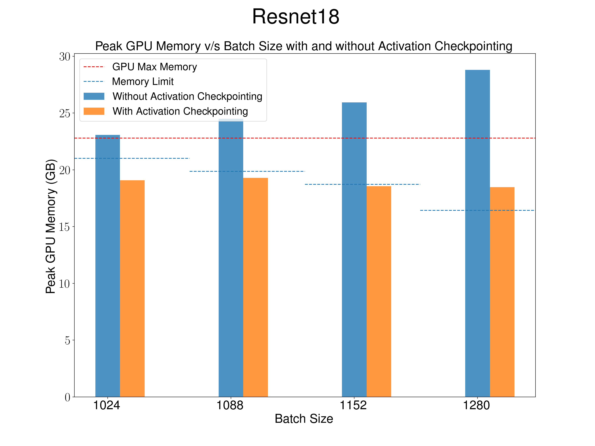

# cs265-mlsys-2024

# Activation Checkpointing: Trading off compute for memory in deep neural network training

An activation checkpointing algorithm implementation to scale deep learning training workloads beyond batch sizes that entirely fit (including intermediate activations) on a single GPU.

<div style="display:flex;">
    
    
    
</div>

<div style="display:flex;">
    
    
    
</div>

## Instructions

```bash
git clone https://github.com/harsha070/cs265-mlsys-2024.git
git clone https://github.com/pytorch/benchmark
pip install -e benchmark/
```

```bash
!sed -i '935d' /usr/local/lib/python3.10/dist-packages/transformers/models/bert/modeling_bert.py
```

Enable operator fusion in optimizer.

1. Change ~/benchmark/torchbenchmark/util/framework/huggingface/basic_configs.py line 309-314. Add `fused=True` to optimizer kwargs.
2. Change~/benchmark/torchbenchmark/util/framework/vision/model_factory.py line 39. Add `fused=True` to optimizer kwargs.

To benchmark a model run,

```bash
python cs265-mlsys-2024/benchmarks.py torchbenchmark.models.hf_Bert.Model 24
```

```bash
python cs265-mlsys-2024/benchmarks.py torchbenchmark.models.resnet18.Model 1024
```

```bash
python cs265-mlsys-2024/benchmarks.py torchbenchmark.models.resnet50.Model 256
```